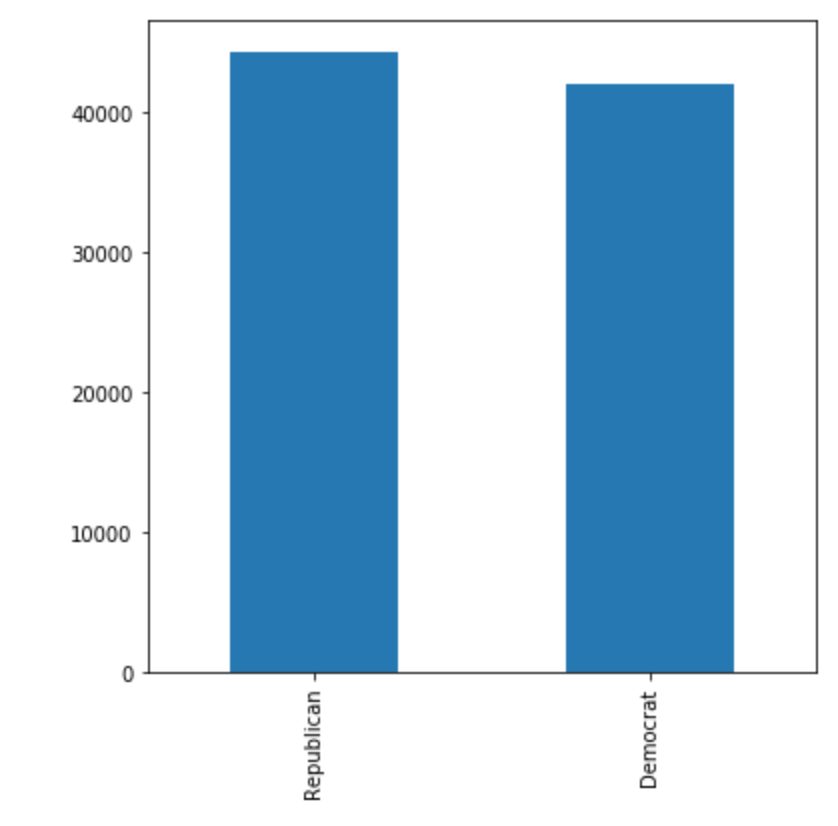
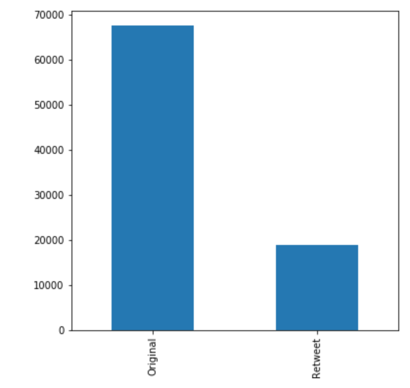
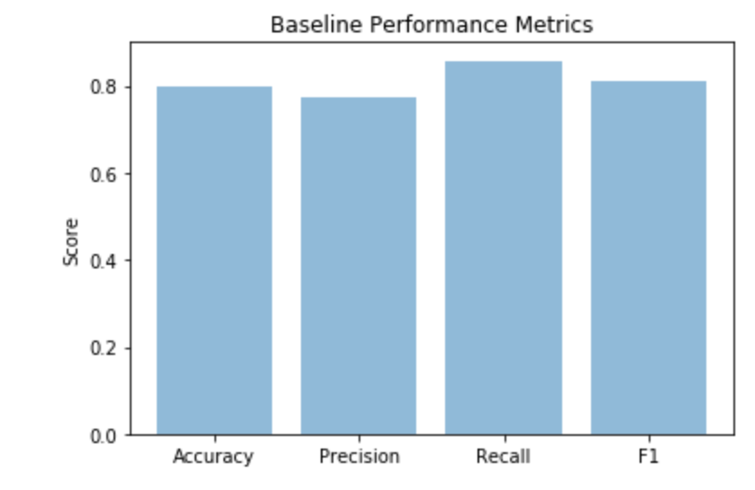
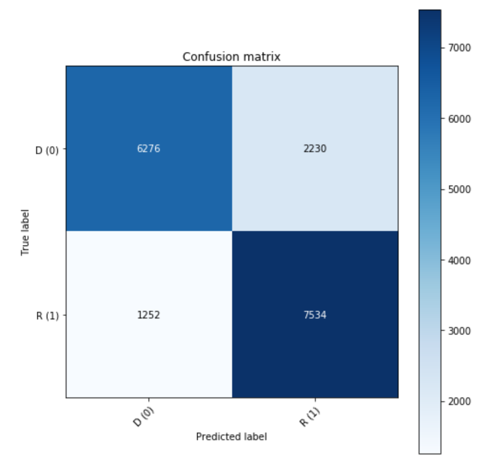

# Machine Learning Engineer Nanodegree
## Capstone Project
Mark Bastian  
December 31st, 2050

#Political Tweet Classification

## I. Definition

### Project Overview
Twitter is a common platform for people, including politicians, to express their views. Often tweets are highly polarized and opinionated, especially given the current political climate in the United States as well as the [rise of fake "Trolling" tweets](https://www.vox.com/2018/10/19/17990946/twitter-russian-trolls-bots-election-tampering). Given this, it is valuable to have tools to answer such questions as:

* Is this a tweet from a real person?
* What are the political leanings of a tweet?
* Can I determine the party of the author of a tweet?

Besides being interesting, such a tool could be useful for doing things such as targeted advertising of candidates to twitter users in general. Users that express sentiments that correlate well to one party would be good targets for advertising for issues or candidates with similar sentiments and values.

A massive amount of related work exists, including:

* [Actionable and Political Text Classification using Word
Embeddings and LSTM](https://arxiv.org/pdf/1607.02501v2.pdf)
* [Leveraging Deep Learning for Political Leaning Classification](https://medium.com/@sofronije/leveraging-deep-learning-for-political-leaning-classification-4ddf9d1d2f53)
* [On Classifying the Political Sentiment of Tweets](https://pdfs.semanticscholar.org/fe57/b7e7e2d228f02ad60f419e049ce2d223eb86.pdf)
* [Text Classifiers for Political Ideologies](https://nlp.stanford.edu/courses/cs224n/2009/fp/7.pdf)
* [Topic-centric Classification of Twitter
User’s Political Orientation](http://terrierteam.dcs.gla.ac.uk/publications/fang2015sigir.pdf)

### Problem Statement
The problem I solved is classification of the author of a tweet into one of the two major US political parties (Republican or Democrat). Specifically, the model models I developed take a tweet or tweet length text as input and produce a prediction of whether the tweet's author is a Democrat or Republican. The input is expected to be political in nature, so I do not detect non-political tweets and I limit the output categories to only the two major parties.

The dataset I trained on is sourced such that I know beforehand the party of the tweet. This can be broken up into testing and training sets to measure goodness of model fit.

### Metrics
As all data has is already tagged, it is appropriate to use precision, recall, accuracy, f1 score, and a confusion matrix to evaluate the quality of my solution.

## II. Analysis

### Data Exploration
I used the Democrat Vs. Republican Tweets dataset [found here](https://www.kaggle.com/kapastor/democratvsrepublicantweets). 

This dataset provides 86,460 tweets divided roughly evenly (over 42,000 tweets per party) and is sufficiently large to produce sizeable testing and training sets. As the authors are all politicans it is implicitly categorized by the author's political affiliation.

This was loaded using the following code:

```python
categories = ['Democrat', 'Republican']
tweetsdf = pd.read_csv('democratvsrepublicantweets/ExtractedTweets.csv')
handlesdf = pd.read_csv('democratvsrepublicantweets/TwitterHandles.csv')
raw_tweets = tweetsdf['Tweet']
parties = tweetsdf['Party']
y = 1.0 - np.asarray(parties == 'Democrat')
X_train, X_test, y_train, y_test = train_test_split(raw_tweets, 
                                                    y, 
                                                    test_size=0.2,
                                                    random_state=42)
```
The above code listing was used for all models.

### Exploratory Visualization
As can be seen in the below image, the number of tweets is fairly evenly split between parties (Republican=44392, Democrat=42068).



Futhermore, the number of original tweets is fairly high compared to the number of retweets. It is possible that a retweet might cause data duplication or be something that doesn't express the original opinion of the retweeter, but I am going to assume that if a tweet is repeated by an individual then they agree with it.



### Algorithms and Techniques
My intent for this project was two solve the problem using two categories of algorithms and compare the results. The first would be a Naive Bayes Classifier and the second would be a Neural Network. The specifics of the latter were left open in the proposal as there are a lot of different potential architectures and I wanted to investigate several. I ended up trying our several techniques, including word and character embedding layers, 1D convolutional networks, and LSTM layers.

### Benchmark
My baseline model was a simple Naive Bayes Classifier created using the following pipeline:

```python
model = Pipeline([('vect', CountVectorizer()), 
                  ('tfidf', TfidfTransformer()), 
                  ('clf', MultinomialNB())])
```

As shown above, I used an 80/20 split to divide training and testing data for all experiments. 

The baseline Naive Bayes Classifier produced accuracy, precision, recall, and f1 scores of 0.80, 0.77, 0.86, and 0.81, respectively, and is show graphically here:



The corresponding confusion matrix is shown here:



Since this is a fairly evenly split dataset and there is no preference for precsion or recall, accuracy is probably the most useful metric as we have an equal preference for correct classification into either class. The baseline accuracy is computed as total correctly classified items over the total population, that is (6276 + 7534) / (6276 + 7534 + 1252 + 2230), which is 80%.

## III. Methodology
The goal of the remainder of this project was to compare the above model with several neural network architectures to see if the networks could be tuned to give better overall performance, with accuracy being the most interesting metric.

The following networks were tried:
1. A 1D Convolutional Network
2. A 1D Convolutional Network with dropout layers added to prevent overfitting
3. A Character Embedding Layer followed by a Convolutional Layer
4. A Character Embedding Layer followed by two Convolutional Layers
5. A Character Embedding Layer followed by three Convolutional Layers. This trial was meant to investigate if network depth did a better job of generalizing than network width.

### Data Preprocessing
For all character-level encodings, the following transform was applied to get the data in the right format:

```python
def create_encoder_decoder(all_text):
    chars = sorted(set(all_text))
    char_to_int = dict((c, i + 1) for i, c in enumerate(chars))
    int_to_char = dict((i + 1, c) for i, c in enumerate(chars))
    return char_to_int, int_to_char


def encode_string(line, char_to_int, l):
    z = np.zeros(l)
    z[0:len(line)] = [char_to_int[c] for c in line]
    return z


def encode_strings(lines, char_to_int, l):
    return np.array([encode_string(line, char_to_int, l) for line in lines])
```

This was applied like so:

```python
X = encoders.encode_strings(normalized_tweets, char_to_int, max_tweet_len)
X_train, X_test, y_train, y_test = train_test_split(X, y, 
                                                    test_size=0.2, 
                                                    random_state=42)
```

### Implementation
In this section, the process for which metrics, algorithms, and techniques that you implemented for the given data will need to be clearly documented. It should be abundantly clear how the implementation was carried out, and discussion should be made regarding any complications that occurred during this process. Questions to ask yourself when writing this section:
- _Is it made clear how the algorithms and techniques were implemented with the given datasets or input data?_
- _Were there any complications with the original metrics or techniques that required changing prior to acquiring a solution?_
- _Was there any part of the coding process (e.g., writing complicated functions) that should be documented?_

### Refinement
In this section, you will need to discuss the process of improvement you made upon the algorithms and techniques you used in your implementation. For example, adjusting parameters for certain models to acquire improved solutions would fall under the refinement category. Your initial and final solutions should be reported, as well as any significant intermediate results as necessary. Questions to ask yourself when writing this section:
- _Has an initial solution been found and clearly reported?_
- _Is the process of improvement clearly documented, such as what techniques were used?_
- _Are intermediate and final solutions clearly reported as the process is improved?_


## IV. Results
_(approx. 2-3 pages)_

### Model Evaluation and Validation
In this section, the final model and any supporting qualities should be evaluated in detail. It should be clear how the final model was derived and why this model was chosen. In addition, some type of analysis should be used to validate the robustness of this model and its solution, such as manipulating the input data or environment to see how the model’s solution is affected (this is called sensitivity analysis). Questions to ask yourself when writing this section:
- _Is the final model reasonable and aligning with solution expectations? Are the final parameters of the model appropriate?_
- _Has the final model been tested with various inputs to evaluate whether the model generalizes well to unseen data?_
- _Is the model robust enough for the problem? Do small perturbations (changes) in training data or the input space greatly affect the results?_
- _Can results found from the model be trusted?_

### Justification
In this section, your model’s final solution and its results should be compared to the benchmark you established earlier in the project using some type of statistical analysis. You should also justify whether these results and the solution are significant enough to have solved the problem posed in the project. Questions to ask yourself when writing this section:
- _Are the final results found stronger than the benchmark result reported earlier?_
- _Have you thoroughly analyzed and discussed the final solution?_
- _Is the final solution significant enough to have solved the problem?_


## V. Conclusion
_(approx. 1-2 pages)_

### Free-Form Visualization
In this section, you will need to provide some form of visualization that emphasizes an important quality about the project. It is much more free-form, but should reasonably support a significant result or characteristic about the problem that you want to discuss. Questions to ask yourself when writing this section:
- _Have you visualized a relevant or important quality about the problem, dataset, input data, or results?_
- _Is the visualization thoroughly analyzed and discussed?_
- _If a plot is provided, are the axes, title, and datum clearly defined?_

### Reflection
In this section, you will summarize the entire end-to-end problem solution and discuss one or two particular aspects of the project you found interesting or difficult. You are expected to reflect on the project as a whole to show that you have a firm understanding of the entire process employed in your work. Questions to ask yourself when writing this section:
- _Have you thoroughly summarized the entire process you used for this project?_
- _Were there any interesting aspects of the project?_
- _Were there any difficult aspects of the project?_
- _Does the final model and solution fit your expectations for the problem, and should it be used in a general setting to solve these types of problems?_

### Improvement
In this section, you will need to provide discussion as to how one aspect of the implementation you designed could be improved. As an example, consider ways your implementation can be made more general, and what would need to be modified. You do not need to make this improvement, but the potential solutions resulting from these changes are considered and compared/contrasted to your current solution. Questions to ask yourself when writing this section:
- _Are there further improvements that could be made on the algorithms or techniques you used in this project?_
- _Were there algorithms or techniques you researched that you did not know how to implement, but would consider using if you knew how?_
- _If you used your final solution as the new benchmark, do you think an even better solution exists?_

-----------

**Before submitting, ask yourself. . .**

- Does the project report you’ve written follow a well-organized structure similar to that of the project template?
- Is each section (particularly **Analysis** and **Methodology**) written in a clear, concise and specific fashion? Are there any ambiguous terms or phrases that need clarification?
- Would the intended audience of your project be able to understand your analysis, methods, and results?
- Have you properly proof-read your project report to assure there are minimal grammatical and spelling mistakes?
- Are all the resources used for this project correctly cited and referenced?
- Is the code that implements your solution easily readable and properly commented?
- Does the code execute without error and produce results similar to those reported?
