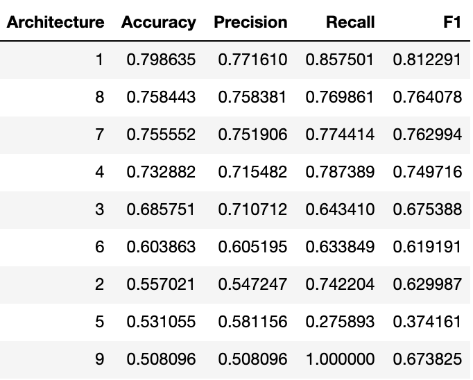

# Machine Learning Engineer Nanodegree
## Capstone Project
Mark Bastian  
December 31st, 2050

#Political Tweet Classification

## I. Definition

### Project Overview
Twitter is a common platform for people, including politicians, to express their views. Often tweets are highly polarized and opinionated, especially given the current political climate in the United States as well as the [rise of fake "Trolling" tweets](https://www.vox.com/2018/10/19/17990946/twitter-russian-trolls-bots-election-tampering). Given this, it is valuable to have tools to answer such questions as:

* Is this a tweet from a real person?
* What are the political leanings of a tweet?
* Can I determine the party of the author of a tweet?

Besides being interesting, such a tool could be useful for doing things such as targeted advertising of candidates to twitter users in general. Users that express sentiments that correlate well to one party would be good targets for advertising for issues or candidates with similar sentiments and values.

A massive amount of related work exists, including:

* [Actionable and Political Text Classification using Word
Embeddings and LSTM](https://arxiv.org/pdf/1607.02501v2.pdf)
* [Leveraging Deep Learning for Political Leaning Classification](https://medium.com/@sofronije/leveraging-deep-learning-for-political-leaning-classification-4ddf9d1d2f53)
* [On Classifying the Political Sentiment of Tweets](https://pdfs.semanticscholar.org/fe57/b7e7e2d228f02ad60f419e049ce2d223eb86.pdf)
* [Text Classifiers for Political Ideologies](https://nlp.stanford.edu/courses/cs224n/2009/fp/7.pdf)
* [Topic-centric Classification of Twitter
User’s Political Orientation](http://terrierteam.dcs.gla.ac.uk/publications/fang2015sigir.pdf)

### Problem Statement
The problem I solved is classification of the author of a tweet into one of the two major US political parties (Republican or Democrat). Specifically, the model models I developed take a tweet or tweet length text as input and produce a prediction of whether the tweet's author is a Democrat or Republican. The input is expected to be political in nature, so I do not detect non-political tweets and I limit the output categories to only the two major parties.

The dataset I trained on is sourced such that I know beforehand the party of the tweet. This can be broken up into testing and training sets to measure goodness of model fit.

### Metrics
As all data is already tagged, it is appropriate to use precision, recall, accuracy, f1 score, and a confusion matrix to evaluate the quality of my solution.

## II. Analysis

### Data Exploration
I used the Democrat Vs. Republican Tweets dataset [found here](https://www.kaggle.com/kapastor/democratvsrepublicantweets). 

This dataset provides 86,460 tweets divided roughly evenly (over 42,000 tweets per party) and is sufficiently large to produce sizeable testing and training sets. As the authors are all politicans it is implicitly categorized by the author's political affiliation.

This was loaded using the following code:

```python
categories = ['Democrat', 'Republican']
tweetsdf = pd.read_csv('democratvsrepublicantweets/ExtractedTweets.csv')
handlesdf = pd.read_csv('democratvsrepublicantweets/TwitterHandles.csv')
raw_tweets = tweetsdf['Tweet']
parties = tweetsdf['Party']
y = 1.0 - np.asarray(parties == 'Democrat')
X_train, X_test, y_train, y_test = train_test_split(raw_tweets, 
                                                    y, 
                                                    test_size=0.2,
                                                    random_state=42)
```
The above code listing was used for all models.

### Exploratory Visualization
As can be seen in the below image, the number of tweets is fairly evenly split between parties (Republican=44392, Democrat=42068).


Futhermore, the number of original tweets is fairly high compared to the number of retweets. It is possible that a retweet might cause data duplication or be something that doesn't express the original opinion of the retweeter, but I am going to assume that if a tweet is repeated by an individual then they agree with the views expressed in the original  tweet.


### Algorithms and Techniques
My intent for this project was two solve the problem using two categories of algorithms and compare the results. The first would be a Naive Bayes Classifier and the second would be a Neural Network. The specifics of the latter were left open in the proposal as there are a lot of different potential architectures and I wanted to investigate several. I ended up trying our several techniques, including word and character embedding layers, 1D convolutional networks, and LSTM layers.

### Benchmark
My baseline model was a simple Naive Bayes Classifier created using the following pipeline:

```python
model = Pipeline([('vect', CountVectorizer()), 
                  ('tfidf', TfidfTransformer()), 
                  ('clf', MultinomialNB())])
```

As shown above, I used an 80/20 split to divide training and testing data for all experiments. 

The baseline Naive Bayes Classifier produced accuracy, precision, recall, and f1 scores of 0.80, 0.77, 0.86, and 0.81, respectively, and is show graphically here:


The corresponding confusion matrix is shown here:


Since this is a fairly evenly split dataset and there is no preference for precsion or recall, accuracy is probably the most useful metric as we have an equal preference for correct classification into either class. The baseline accuracy is computed as total correctly classified items over the total population, that is (6276 + 7534) / (6276 + 7534 + 1252 + 2230), which is 80%.

## III. Methodology
The goal of the remainder of this project was to compare the above model with several neural network architectures to see if the networks could be tuned to give better overall performance, with accuracy being the most interesting metric.

The following networks were tried:

1. A 1D Convolutional Network
2. A 1D Convolutional Network with dropout layers added to prevent overfitting
3. A Character Embedding Layer (dimension 256) followed by a Convolutional Layer with 256 filters.
4. A Character Embedding Layer (dimension 256) followed by two Convolutional Layers with 256 then 128 filters.
5. A Character Embedding Layer (dimension 256) followed by three Convolutional Layers with 64, 32, then 16 filters. A 512 unit Dense Layer followed the Convolutional Layers. This trial was meant to investigate if network depth did a better job of generalizing than network width.
6. A Character Embedding Layer (dimension 32) followed by a 2 unit LSTM. This was meant to see if a smaller network with different layer types would perform differently.
7. A Word Embedding Layer (dimension 100) followed by two Convolutional Layers (128 and 64 filters).
8. The same architecture as network 7, but with a different strategy for generating the vocabulary.
9. A Characer Embedding Layer (dimension 64) followed by two LSTM layers of dimension 64. This was done to see if more "memory" would assist in a better fit.

All models can be found [here](https://github.com/markbastian/capstone) in notebooks starting with the model number (e.g. 1_political_party_classifier.ipynb for Architecture 1).

All Convolutional Layers are followed by a Max Pooling layer with a pool size of 2. Each of the above networks was completed with a 2 element Dense layer (one for each final category) with softmax activation.

These different ideas were inspired by many different blog posts, including:

* [How to Use Word Embedding Layers for Deep Learning with Keras](https://machinelearningmastery.com/use-word-embedding-layers-deep-learning-keras/)
* [What Are Word Embeddings for Text?](https://machinelearningmastery.com/what-are-word-embeddings/)
* [How to Develop a Word Embedding Model for Predicting Movie Review Sentiment
](https://machinelearningmastery.com/develop-word-embedding-model-predicting-movie-review-sentiment/)
* [Embed, encode, attend, predict: The new deep learning formula for state-of-the-art NLP models](https://explosion.ai/blog/deep-learning-formula-nlp)
* [How to Develop Word Embeddings in Python with Gensim](https://machinelearningmastery.com/develop-word-embeddings-python-gensim/)
* [Stacked Long Short-Term Memory Networks](https://machinelearningmastery.com/stacked-long-short-term-memory-networks/)

### Data Preprocessing
For all character-level encodings, the following transform was applied to get the data in the right format:

```python
def create_encoder_decoder(all_text):
    chars = sorted(set(all_text))
    char_to_int = dict((c, i + 1) for i, c in enumerate(chars))
    int_to_char = dict((i + 1, c) for i, c in enumerate(chars))
    return char_to_int, int_to_char


def encode_string(line, char_to_int, l):
    z = np.zeros(l)
    z[0:len(line)] = [char_to_int[c] for c in line]
    return z


def encode_strings(lines, char_to_int, l):
    return np.array([encode_string(line, char_to_int, l) for line in lines])
```

This was applied like so:

```python
X = encoders.encode_strings(normalized_tweets, char_to_int, max_tweet_len)
X_train, X_test, y_train, y_test = train_test_split(X, y, 
                                                    test_size=0.2, 
                                                    random_state=42)
```

For the first word embedding architecture (Architecure 7, above), the following additional transformations were used to encode the words:

```python
cv = CountVectorizer(stop_words='english', strip_accents='ascii')
bag_of_words = cv.fit_transform([re.sub(r'https?://[^\s]+', '', tweet) for tweet in raw_tweets])

vocab = {}
for feature, freq in zip(cv.get_feature_names(), bag_of_words.sum(axis=0).tolist()[0]):
    if freq > 10:
        vocab[feature] = freq

vocabulary = list(vocab.keys())
vocabulary_size = len(vocabulary) + 1

word_to_int = {word: i + 1 for i, word in enumerate(vocabulary)}
int_to_word = {i + 1: word for i, word in enumerate(vocabulary)}

encoded_tweets =\
    [[word_to_int.get(word, 0) for word in word_tokenize(re.sub(r'https?://[^\s]+', '', tweet).lower())
      if word in word_to_int]
     for tweet in raw_tweets]
```

For Architecture 8, the following word encoding was used:

```python
def tokenize_tweet(s):
    s = s.lower()
    s = re.sub(r'https?://[^\s]+', '', s)
    s = re.sub(r'[^A-Za-z\s$#@0-9]+', '', s)
    s = re.sub(r'\s+', ' ', s)
    return [tok for tok in s.strip().split(' ') if tok not in english_stopwords]
    
tokenized_tweets = [tokenize_tweet(tweet) for tweet in raw_tweets]

vocab = {}
for toks in tokenized_tweets:
    for tok in toks:
        if tok in vocab:
            vocab[tok] += 1
        else:
            vocab[tok] = 1
            
vocab = {k:v for k,v in vocab.items() if v > 10}

vocabulary = list(vocab.keys())
vocabulary_size = len(vocabulary) + 1

word_to_int = {word: i + 1 for i, word in enumerate(vocabulary)}
int_to_word = {i + 1: word for i, word in enumerate(vocabulary)}

encoded_tweets =\
    [[word_to_int.get(tok, 0) for tok in toks if tok in word_to_int]
     for toks in tokenized_tweets]
```

This second encoding used my own tokenizer in which I removed urls and emojis, but kept hashtags and 'at' targets (e.g. @soandso). This was done to see if perhaps there was any significance to keeping those items in the vocabulary.

### Implementation
For each architecture, the networks were run for at least 100 epochs and weights were saved if loss improved. Due to the challenges of keeping track of the number of runs for long time periods on local hardware (or sometimes using AWS instances) the number of specific epochs were not tracked specifically. Generally, however, losses were at a minimal or near minimal state after this time period and rarely showed additional improvement with further iteration.

The code shown above was used for each architecture and models were put in a models.py file so that most notebooks have a section that loads the files and is then generally followed by several common code blocks.

First, the models are loaded from models.py:

```python
# note that the model number (e.g. model5) would change per notebook
filepath, model = models.model5(len(char_to_int) + 1, max_tweet_len)
if filepath in os.listdir():
    model.load_weights(filepath)
model.summary()
```

Next, training was done using a common function:

```python
def train(X_train, y_train, model, filepath, num_epochs=100, batch_size=1000):
    checkpoint = ModelCheckpoint(filepath, monitor='loss', verbose=1, save_best_only=True, mode='min')
    tensorboard = TensorBoard(log_dir="logs/{}".format(time()))
    callbacks_list = [checkpoint, tensorboard]
    model.fit(X_train,
              np_utils.to_categorical(y_train),
              epochs=num_epochs,
              batch_size=batch_size,
              callbacks=callbacks_list)
```
This training function would be called several times if convergence was not achieved. Generally losses did not improve with most models after 200 epochs.

Finally, results were computed and plotted as follows:

```python
predictions = np.argmax(model.predict(X_test), axis=1)

metrics, confusion_matrix = models.plot_results(y_test, predictions)
(accuracy, precision, recall, f1) = metrics
print('Accuracy: %s' % accuracy)
print('Precision: %s' % precision)
print('Recall: %s' % recall)
print('F1: %s' % f1)
```

`plot_results` provided a common set of results as computed here:

```python
def plot_results(y_test, predictions):
    objects = ('Accuracy', 'Precision', 'Recall', 'F1')
    y_pos = np.arange(len(objects))
    performance = [accuracy_score(y_test, predictions),
                   precision_score(y_test, predictions),
                   recall_score(y_test, predictions),
                   f1_score(y_test, predictions)]
    cm = confusion_matrix(y_test, predictions)

    plt.bar(y_pos, performance, align='center', alpha=0.5)
    plt.xticks(y_pos, objects)
    plt.ylabel('Score')
    plt.title('Baseline Performance Metrics')
    plt.show()

    plt.rcParams["figure.figsize"] = (7,7)
    classes=np.array(['D (0)', 'R (1)'])
    plot_confusion_matrix.plot_confusion_matrix(y_test.astype(int), predictions.astype(int), 
                                                classes=classes,
                                                title='Confusion matrix')
    plt.show()
    # This is a variation of the example found online at
    # https://scikit-learn.org/stable/auto_examples/model_selection/plot_confusion_matrix.html
    plot_confusion_matrix.plot_confusion_matrix(y_test.astype(int), predictions.astype(int), 
                                                classes=classes, 
                                                normalize=True,
                                                title='Normalized confusion matrix')
    plt.show()

    return performance, cm
```

Complete listings of all code and implementations can be found at [https://github.com/markbastian/capstone](https://github.com/markbastian/capstone).

### Refinement
The various architectures 1-9 above were each created as a follow on to the previous architecture in an attempt to explore what could be improved or attempted as a next experiment. In many cases, the follow on architecure was "going wider" by expanding the number of units or "going deeper" by adding additional layers (but halving the units or filters).


## IV. Results

### Model Evaluation and Validation
As was stated previously, accuracy is the driving metric for this study as there is no preference for precision or recall and the data is divided fairly evenly. A summary of the architectures are listed here, sorted by accuracy.



A few interesting observations:

* The initial baseline model (A Naive Bayes Classifier) outperformed the other models.
* Word embeddings were the next best models.
* The next group used character embeddings with 2 convolutional layers.
* With the exception of the "complicated" architectures, a simple deep network with no embeddings did worse than the other architectures.
* Architectures 5 and 9 fared worst. These both are characterized by having more deep layers than their counterparts (3 vs. 2 Convolutional Layers or 2 large LSTM layers vs. 1 smaller LSTM layer). In fact, architectue 9 classified all tweets as Republican, so obviously did not learn much at all.

All of these models were evaluated using the 20% split testing data, so I have a high degree of confidence in their results.

### Justification
While I am a bit disappointed that none of the architectures beat a basic Naive Bayes Classifier, the "intent for this project was two solve the problem using two categories of algorithms and compare the results," and not to explicitly beat the Naive Bayes Classifier. The thing I feel needs the most defense is the final set of architectures used. I wanted to try architectures with character embeddings, word embeddings, LSTMs, and CNNs and there are effectively an infinte number of combinations of layers, activation functions, and hyperparameters (e.g. units or filters) that can be chosen from. I felt that the architectures used were fairly representative of basic architectures described online and in the class.


## V. Conclusion
_(approx. 1-2 pages)_

### Free-Form Visualization
What to do??????

In this section, you will need to provide some form of visualization that emphasizes an important quality about the project. It is much more free-form, but should reasonably support a significant result or characteristic about the problem that you want to discuss. Questions to ask yourself when writing this section:
- _Have you visualized a relevant or important quality about the problem, dataset, input data, or results?_
- _Is the visualization thoroughly analyzed and discussed?_
- _If a plot is provided, are the axes, title, and datum clearly defined?_

### Reflection
In this project, several architectures were chosen and evaluated.

In this section, you will summarize the entire end-to-end problem solution and discuss one or two particular aspects of the project you found interesting or difficult. You are expected to reflect on the project as a whole to show that you have a firm understanding of the entire process employed in your work. Questions to ask yourself when writing this section:
- _Have you thoroughly summarized the entire process you used for this project?_
- _Were there any interesting aspects of the project?_
- _Were there any difficult aspects of the project?_
- _Does the final model and solution fit your expectations for the problem, and should it be used in a general setting to solve these types of problems?_

### Improvement
In this section, you will need to provide discussion as to how one aspect of the implementation you designed could be improved. As an example, consider ways your implementation can be made more general, and what would need to be modified. You do not need to make this improvement, but the potential solutions resulting from these changes are considered and compared/contrasted to your current solution. Questions to ask yourself when writing this section:
- _Are there further improvements that could be made on the algorithms or techniques you used in this project?_
- _Were there algorithms or techniques you researched that you did not know how to implement, but would consider using if you knew how?_
- _If you used your final solution as the new benchmark, do you think an even better solution exists?_

-----------

**Before submitting, ask yourself. . .**

- Does the project report you’ve written follow a well-organized structure similar to that of the project template?
- Is each section (particularly **Analysis** and **Methodology**) written in a clear, concise and specific fashion? Are there any ambiguous terms or phrases that need clarification?
- Would the intended audience of your project be able to understand your analysis, methods, and results?
- Have you properly proof-read your project report to assure there are minimal grammatical and spelling mistakes?
- Are all the resources used for this project correctly cited and referenced?
- Is the code that implements your solution easily readable and properly commented?
- Does the code execute without error and produce results similar to those reported?
